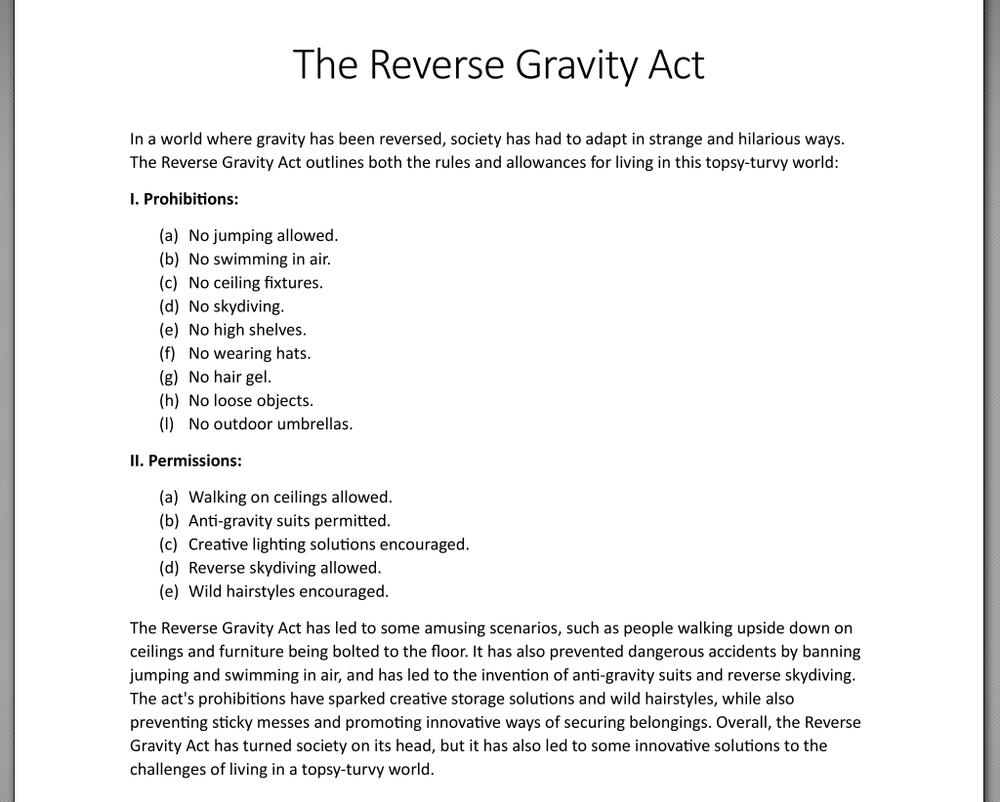
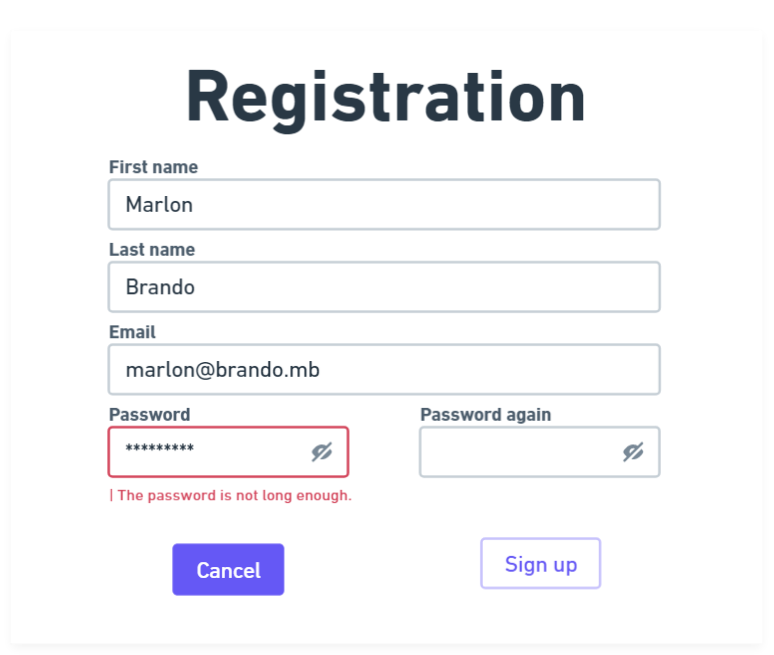

# CommIT Smart

[commitsmart.com](https://commitsmart.com)

[info@commitsmart.com](mailto:info@commitsmart.com)

## QA Manual Tester Assignment

The purpose of this assignment is to assess your knowledge and skills as an IT manual tester, covering different areas such as test case design, bug reporting, user experience, debugging, and browser developer tools usage.

In each task, you will be presented with a specific scenario related to one of these areas, and you will be asked to work out a solution to the given problem.

Don't stress if you can't get every part done - spend a maximum of 3 hours on this assignment. Feel free to add comments or notes to help us understand your thinking and decisions. We value both the final results and the reasoning behind them.

Submit your solution via [email](mailto:jobs@commitsmart.com) by creating a Word document or create a Google Doc and sharing it with the jobs@commitsmart.com account.

---

## Assignment

**1. Bug Reporting**

You are testing a new feature on a mobile app that allows users to book flights. During testing, you noticed that the app crashes when a user attempts to select a flight from a list of search results. Your task is to report the bug to the development team.

Task:
Write a clear and concise bug report for the issue you have identified. Your bug report should be written in a professional tone and include any info that can help the development team reproduce and debug the issue. Be sure to prioritise clarity and accuracy in your report, and provide as much detail as possible to help the development team address the issue.

**2. Test Case Design**

You are testing an e-commerce website. Your task is to test the wishlist feature. Customers can add products they like to their wishlist and later move them to their shopping cart to purchase. However, only products that are currently in stock can be added to the wishlist. 

Task:
Write test cases for this feature that cover both positive and negative scenarios. Formulate at least one question about the function, the answer to which may influence the expected result in a possible scenario.

**3. Browser Developer Tools Usage**

You are testing a website and need to use the browser developer tools to identify an issue. The issue is that when a user clicks on a button, nothing happens. Using the browser developer tools, find the cause of the issue and provide a solution to fix it. 

Task:
Write 3 examples of possible causes of the issue and briefly explain what you expect in these cases when viewing requests and responses under the Network tab. 

**4. Debugging**

The image below is an extract from the text of a strange law, but unfortunately, it contains a small bug. What is that?

    

**5. Making Suggestion**

The tester's task is not only to detect bugs but also to improve the quality of functions and screens. 

Task:
Make suggestions on how to improve the following screen more user-friendly.

    

